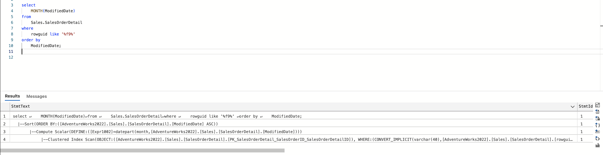
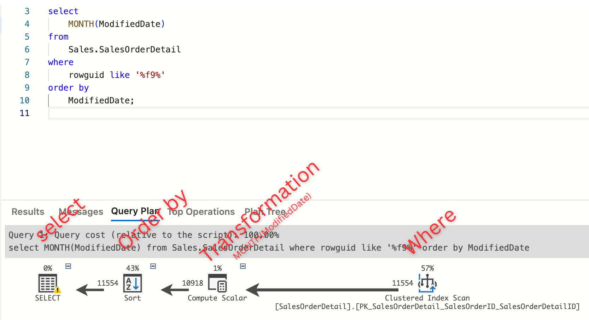

## Want to Run SQL Commands locally and see 
* How it works internally ?
* What is the Order of Execution of a query ?
* That too with Graph :heart_eyes: :heart_eyes: ?

:arrow_right: [check here](RunSQLLocally/README.md)

Example:
- Here is how you could see the Order of Execution of a query ?

- Here is how you could see the Graphical view of a query ?

