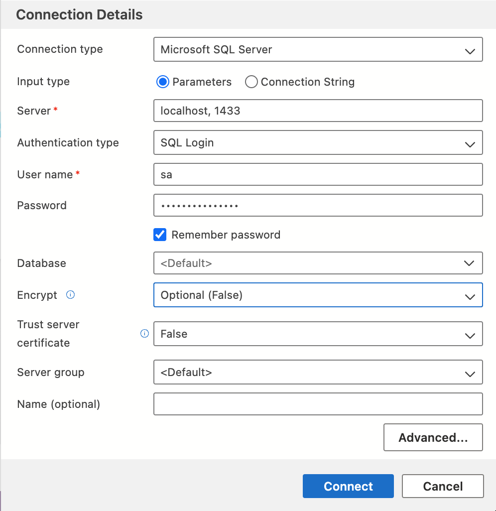
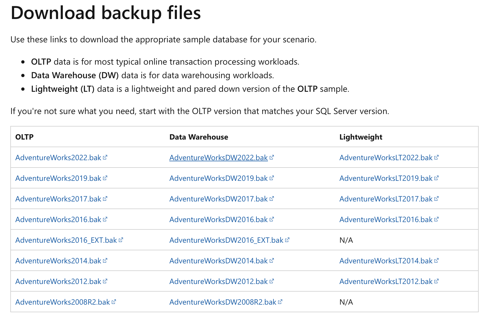
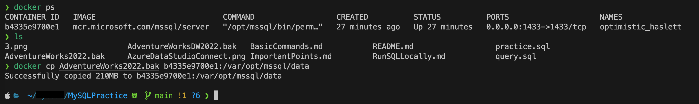
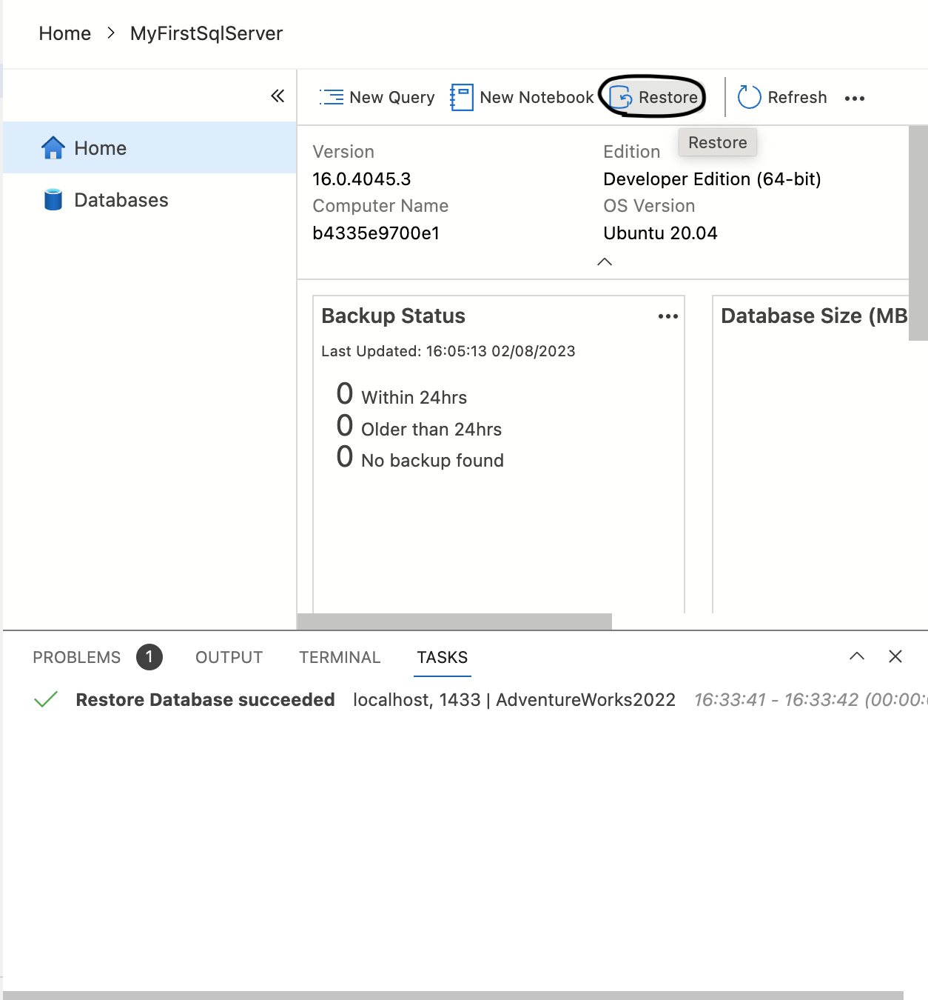
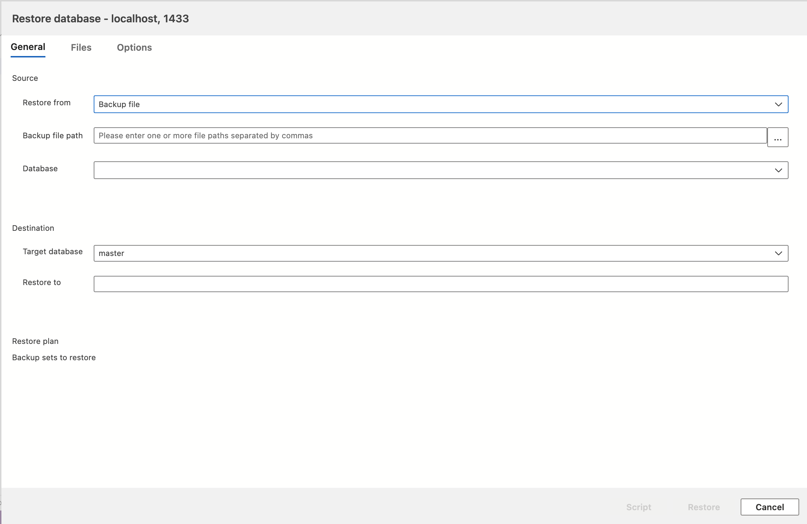
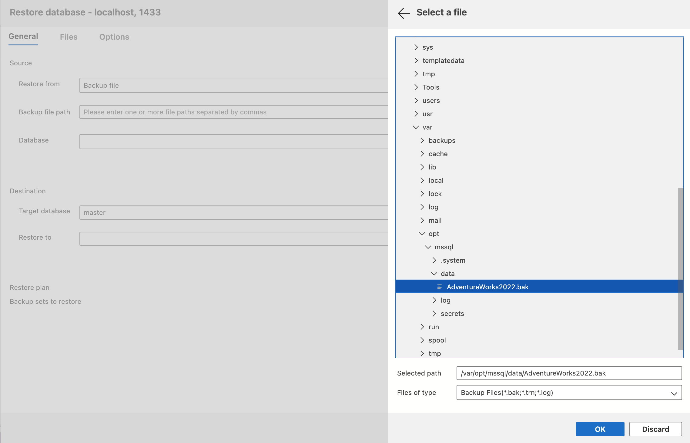
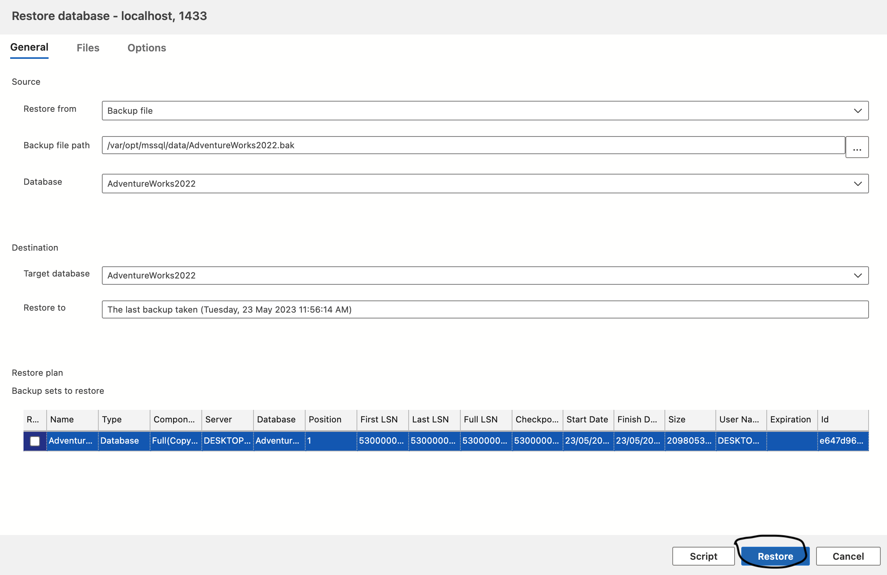
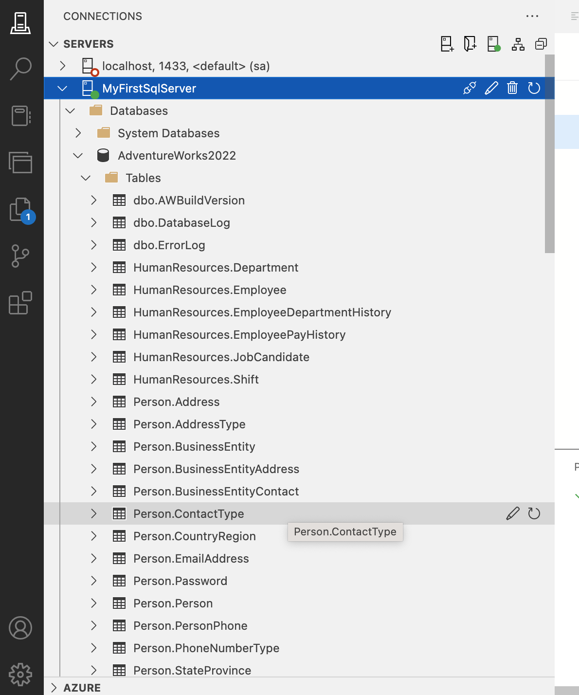

# How to run SQL Commands locally
- This page covers how we can run sql commands in local machine with good understanding of how internally it works using Azure Data Studio.

## Pre Requisites
##### Following needs to be installed
1. Docker
    * for [Windows](https://docs.docker.com/desktop/windows/install/)
    * for [Mac](https://docs.docker.com/desktop/mac/install/)
2. VS Code
    * [Download link](https://code.visualstudio.com/download)

# Steps
1. Pull the Microsoft Sql Server docker image
```
docker pull mcr.microsoft.com/mssql/server
``````
2. Run the docker container with custom password
```
docker run -e 'ACCEPT_EULA=Y' -e 'SA_PASSWORD=Thi$isMyPassw@rd' -p 1433:1433 -d mcr.microsoft.com/mssql/server
```
3. Open **Azure Data Studio** Software that is installed

    - Create new connection
        

    - Then click on connect
4. Load some sample datasets from Microsoft Official website
    [click here](https://learn.microsoft.com/en-us/sql/samples/adventureworks-install-configure?view=sql-server-ver15&tabs=data-studio) 



5. Copying the file to your docker container
```
docker cp <location_of_file> <container_id>:/var/opt/mssql/data
```

Please check example below :



6. Upload the dataset to Azure data studio

    a. Click restore
    

    b. Select "Backup file" in dropdown for Restore from
    

    c. Choose the Backup file path 
    

    d. Click Restore
    
7. Check the tables
    


Thank you, Happy Coding :smile: